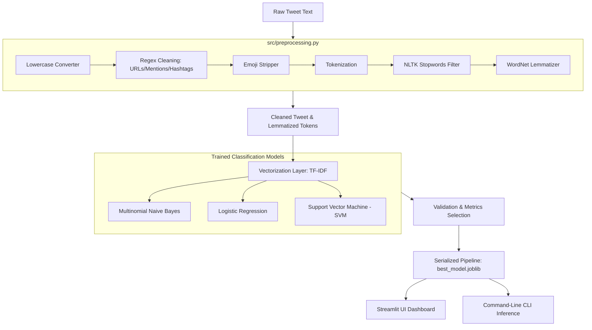

# 🐦 Twitter Sentiment Analysis System

An end-to-end, intelligent multi-class Natural Language Processing (NLP) application that preprocesses, analyzes, and classifies Twitter posts (tweets) into **Positive**, **Negative**, or **Neutral** categories. 

The system trains and compares multiple machine learning pipelines (Logistic Regression, Naive Bayes, and SVM), serializes the best-performing models, and serves them through both a **CLI prediction utility** and a **premium interactive Streamlit visualization dashboard**.

---

## 🏗️ System Architecture & Data Flow



---

## 📂 Project Structure

```
├── data/                      # Cached datasets (auto-downloaded)
│   ├── preprocessed_train.csv # Cleaned training set cache
│   └── preprocessed_val.csv   # Cleaned validation set cache
├── models/                    # Serialized ML Pipelines
│   ├── best_model.joblib      # Calibrated SVM pipeline (Default)
│   ├── logistic_regression.joblib
│   ├── naive_bayes.joblib
│   ├── svm.joblib
│   └── metrics.json           # Evaluation metrics of all trained models
├── src/                       # Core Source Modules
│   ├── data_loader.py         # Downloads, filters, and loads Twitter data
│   ├── preprocessing.py      # Cleans, tokenizes, and lemmatizes text
│   ├── features.py            # Configures TF-IDF & Bag of Words vectorizers
│   ├── models.py              # Builds pipelines and computes performance stats
│   └── predict.py             # Inference class for real-time predictions
├── app.py                     # Streamlit visualization and prediction app
├── train.py                   # Model training entrypoint script
├── requirements.txt           # Python library dependencies
└── README.md                  # Project documentation (this file)
```

---

## ⚙️ Core Modules & Preprocessing Pipeline

### 1. NLP Text Preprocessing (`src/preprocessing.py`)
Cleans noise and normalizes textual structure before vectorization:
*   **Lowercasing**: Standardizes text case.
*   **URL Removal**: Strips hyperlinks starting with `http/https` or `www.`.
*   **Mention Stripping**: Removes target user tags (e.g. `@username`).
*   **Hashtag Cleaning**: Retains the contextual tag word but removes the `#` symbol.
*   **Emoji Stripping**: Cleans unicode emoticons and non-ASCII icons.
*   **Special Character Removal**: Removes non-alphabetic punctuation and numbers.
*   **Stopwords Filter**: Drops highly frequent English grammatical particles (e.g. *the*, *is*, *at*).
*   **WordNet Lemmatization**: Resolves words to their base lexical root form (e.g., *running* -> *run*).

### 2. Feature Extraction (`src/features.py`)
Configures a **TF-IDF Vectorizer** (Term Frequency-Inverse Document Frequency) mapping cleaned text into a sparse numeric matrix. It is tuned with `ngram_range=(1, 2)` (retaining single words and bigrams) and capped at `15,000` features to prevent overfitting.

### 3. Model Training & Comparison (`train.py`)
Trains candidate classifiers on **59,676 samples** and evaluates on **827 validation samples** from the *Twitter Entity Sentiment Analysis* dataset:
*   **Naive Bayes** (Baseline)
*   **Logistic Regression** (Highly calibrated probabilities)
*   **Linear SVM** (Calibrated via cross-validation to provide confidence probabilities)

---

## 📈 Model Performance Benchmark

| Model | Accuracy | F1-Score | Training Speed |
| :--- | :---: | :---: | :---: |
| **Support Vector Machine (SVM)** | **92.50%** | **92.49%** | **9.09 seconds** |
| **Logistic Regression** | **92.02%** | **92.03%** | **3.74 seconds** |
| **Naive Bayes** | **83.92%** | **83.81%** | **2.06 seconds** |

---

## 🚀 Getting Started

### 1. Installation
Clone the repository and install dependencies using `requirements.txt`:

```bash
pip install -r requirements.txt
```

### 2. Run Training Pipeline
Download the dataset, run text cleaning, compare model metrics, and serialize the best pipeline:

```bash
python train.py
```

### 3. Launch the Web Dashboard
Start the interactive Streamlit dashboard server:

```bash
streamlit run app.py
```
Open **`http://localhost:8501`** in your browser.

### 4. Direct Command-Line Predictions
Run predictions on a custom string directly from your shell:

```bash
python src/predict.py "The new update is absolutely spectacular! I love it."
```

*Expected JSON Output:*
```json
{
  "sentiment": "Positive",
  "confidence": 0.81,
  "processed_text": "new update absolutely spectacular love",
  "tokens": ["new", "update", "absolutely", "spectacular", "love"]
}
```

---

## 📺 Dashboard Visual Tabs

*   **🔮 Real-Time Predictor**: Type a custom tweet and view classification labels, confidence progress bars, and the step-by-step preprocessing pipeline output (Original Tweet, Cleaned text, Lemmatized token badges).
*   **📊 Model Benchmarks**: Displays the Accuracy, Precision, Recall, and F1-score cards alongside an interactive Plotly confusion matrix and overall model comparison charts.
*   **📈 Social Media Trends**: Visualizes global sentiment distributions (donut chart) and group-level sentiment distributions across the most discussed topics/brands (entity bar charts).
*   **🗣️ Word Frequencies & Clouds**: Renders interactive Fermat-spiral word clouds showing key vocabulary driving sentiments side-by-side with horizontal occurrence bar charts.
